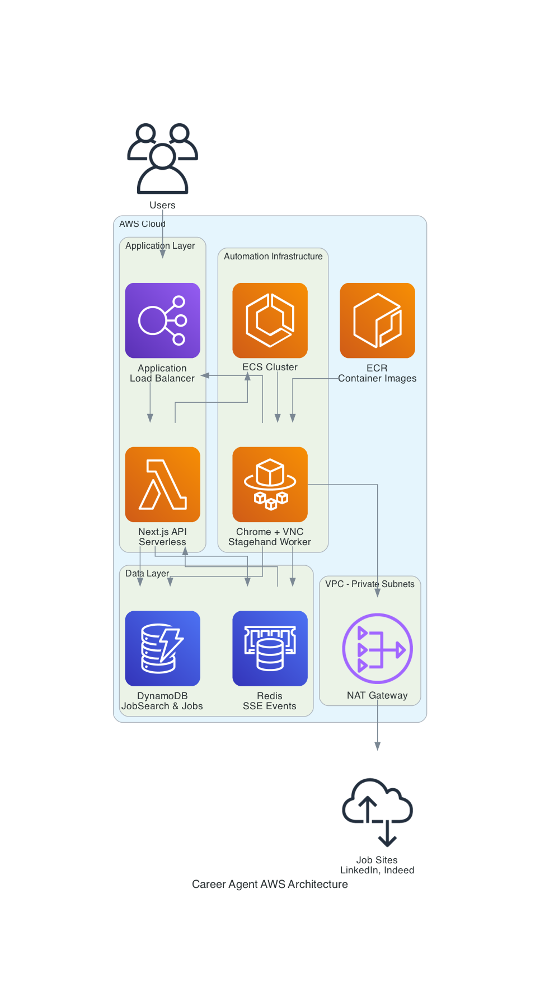

# Career Agent - AWS Service Architecture

A scalable job search automation platform built on AWS services, combining persistent data storage with ephemeral browser automation containers.

## 🏗️ AWS Architecture Overview

Career Agent leverages multiple AWS services to deliver a cost-effective, scalable automation platform that separates persistent user data from ephemeral automation runtime.



## 🔧 AWS Service Breakdown

### **Application Layer**
- **Application Load Balancer (ALB)**: Routes traffic between Next.js API (port 80) and VNC streams (port 8080)
- **Next.js API (Lambda/Serverless)**: Manages job searches, ECS tasks, and serves frontend

### **Data Layer** 
- **DynamoDB**: Persistent storage for `JobSearch` configurations and `Job` results with pay-per-request billing
- **Redis (ElastiCache)**: Real-time event pub/sub for SSE connections and automation status

### **Automation Layer**
- **ECS Fargate**: Serverless containers running Chrome + VNC + Stagehand automation
- **ECR**: Container registry for automation images with lifecycle policies
- **Auto Scaling**: 0-5 tasks based on demand, scales to zero when idle

### **Network Layer**
- **VPC**: Isolated network with public and private subnets
- **NAT Gateway**: Outbound internet access for automation containers in private subnets
- **Security Groups**: Least-privilege access controls

## 🔄 Service Interactions & Data Flow

### **Feature: Persistent Job Search Management**
**AWS Services**: DynamoDB + Next.js API
- `JobSearch` records store user search configurations (keywords, platforms, filters)
- Users can reload previous searches and view historical results
- Pay-per-request billing scales with actual usage

### **Feature: Real-time Browser Automation**
**AWS Services**: ECS Fargate + ECR + ALB
- API creates ECS tasks on-demand when users start job searches
- Docker containers (Chrome + VNC + Stagehand) run in private subnets
- Auto-scaling group maintains 0-5 tasks, scaling to zero when idle
- Each container costs ~$0.05/hour only when running

### **Feature: Live Automation Monitoring**
**AWS Services**: ALB + VNC WebSocket Proxy
- ALB routes VNC traffic (port 8080) from containers to users
- WebSocket connections stream live browser viewport to web interface
- Users can click/type directly in automation browser for manual intervention

### **Feature: Real-time Job Updates**
**AWS Services**: Redis (ElastiCache) + SSE
- Automation containers publish job extractions to Redis channels
- Next.js API subscribes to channels and streams updates via SSE
- Frontend receives live job listings as they're found

### **Feature: Cost Optimization**
**AWS Services**: Fargate + DynamoDB + Auto Scaling
- Fargate containers start/stop on-demand (serverless compute)
- DynamoDB pay-per-request eliminates idle database costs  
- Auto-scaling to zero ensures no charges when not searching jobs

### **Feature: Network Security**
**AWS Services**: VPC + Security Groups + NAT Gateway
- Automation containers run in private subnets (no direct internet access)
- NAT Gateway provides outbound-only internet for job site access
- Security groups restrict inbound traffic to necessary ports only

## 🏛️ AWS Architecture Decisions

### **DynamoDB + Redis Split**
- **DynamoDB**: Structured job data with global scaling and pay-per-request billing
- **Redis**: Fast pub/sub for real-time SSE events (ephemeral data)
- **Cost**: Pay only for actual usage vs always-on database servers

### **ECS Fargate vs EC2/Lambda**
- **Fargate**: Serverless containers with no server management
- **Isolation**: Each job search gets dedicated browser environment  
- **Scaling**: Auto-scales to zero when no searches active
- **Cost**: ~$0.05/hour only when automation running

### **VNC vs Screenshot Polling**
- **VNC**: Standard protocol with real-time interactivity
- **Manual Intervention**: Users can click/type when automation stuck
- **WebSocket Streaming**: Live browser view through ALB routing

### **Private Subnet Architecture**
- **Security**: Automation containers have no direct internet access
- **NAT Gateway**: Outbound-only access to job sites
- **Cost**: Single NAT gateway shared across availability zones

## 💰 Cost Breakdown (Monthly Estimates)

- **DynamoDB**: $0-5 (pay per read/write operations)
- **Redis**: $15-30 (t3.micro ElastiCache instance)  
- **ECS Fargate**: $0-50 (2 vCPU, 4GB RAM, ~$0.05/hour when running)
- **ALB**: $15-25 (always running)
- **NAT Gateway**: $30-45 (data transfer)
- **Total**: ~$60-155/month for moderate usage

## 🚦 Deployment

### Infrastructure Setup
```bash
cd infra
npx cdk deploy  # Creates all AWS resources
```

### Container Deployment  
```bash
docker build -t automation ./docker/automation
aws ecr get-login-password | docker login --username AWS --password-stdin <ecr-uri>
docker push <ecr-uri>/career-agent-automation:latest
```

## 🔮 Production Considerations

- **CloudWatch**: Monitoring for ECS tasks and DynamoDB performance
- **IAM**: Least-privilege roles for all AWS resources
- **SSL/TLS**: HTTPS termination at ALB level
- **Backup**: DynamoDB point-in-time recovery enabled
- **Multi-AZ**: ECS tasks distributed across availability zones