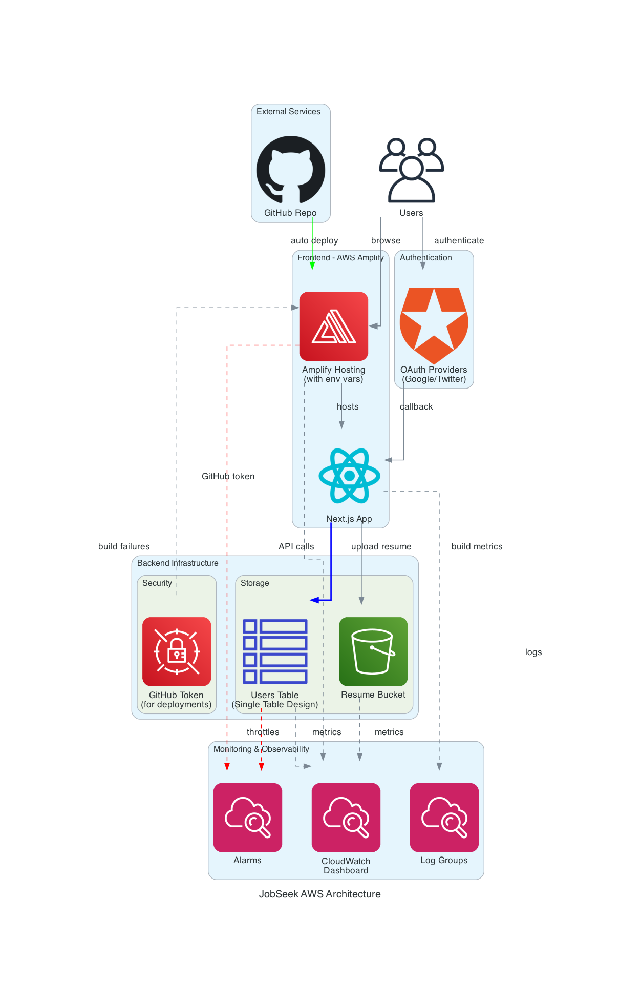

# JobSeek Architecture Design Document

## Overview

JobSeek is a modern job search automation platform built on AWS serverless architecture. The system automates job discovery across multiple boards, manages user profiles and preferences, and provides a streamlined application tracking experience.

## System Components

### Frontend Layer

#### AWS Amplify Hosting
- **Purpose**: Hosts the Next.js application with automatic CI/CD
- **Features**:
  - GitHub integration for automatic deployments
  - Environment-specific branches (dev/staging/prod)
  - Custom domain support
  - Server-side rendering support

#### Next.js Application
- **Framework**: Next.js 14 with App Router
- **UI Components**: Shadcn/ui with Tailwind CSS
- **Authentication**: NextAuth.js with OAuth providers
- **State Management**: React Context API
- **API Routes**: Server-side API endpoints

### Backend Infrastructure

#### Data Layer

**DynamoDB Table (Single Table Design)**
- **Table Name**: `jobseek-users-{environment}`
- **Primary Keys**:
  - Partition Key: `userId`
  - Sort Key: `dataType`
- **Access Patterns**:
  - User profiles: `userId: USER#123, dataType: PROFILE`
  - Saved searches: `userId: USER#123, dataType: SEARCH#456`
  - Saved jobs: `userId: USER#123, dataType: JOB#789`
  - Board preferences: `userId: USER#123, dataType: BOARD#abc`
- **Global Secondary Indexes**:
  - `DataTypeIndex`: Query by data type across users
  - `ActiveSearchesIndex`: Find searches ready to run
  - `BoardVisibilityIndex`: Public/private board discovery
- **Features**:
  - TTL enabled for rate limiting cleanup
  - Point-in-time recovery (production)
  - DynamoDB Streams for change data capture

**S3 Resume Storage**
- **Bucket**: `jobseek-resumes-{environment}-{account}`
- **Features**:
  - Server-side encryption
  - Versioning enabled
  - Lifecycle policies (90-day transition to IA)
  - CORS configured for direct uploads
  - Presigned URL generation for secure access

#### Compute Layer

**Search Scheduler Lambda**
- **Runtime**: Node.js 18.x
- **Trigger**: EventBridge rule (daily at 9 AM)
- **Functionality**:
  - Queries active searches from DynamoDB
  - Calls Wallcrawler API for job discovery
  - Updates search status and next run time
  - Saves discovered jobs to DynamoDB
- **Configuration**:
  - 15-minute timeout
  - 1024 MB memory
  - X-Ray tracing enabled

### Integration Services

#### EventBridge
- **Purpose**: Scheduled task orchestration
- **Rules**:
  - Daily search execution (cron: 0 9 * * *)
  - Future: Email notifications, cleanup tasks

#### Secrets Manager
- **Managed Secrets**:
  - GitHub personal access token (Amplify deployments)
  - Wallcrawler API key
  - OAuth credentials (passed to Amplify)
- **Access**: Services via IAM roles

### Monitoring & Observability

#### CloudWatch Dashboard
- **Metrics Tracked**:
  - DynamoDB read/write capacity and throttles
  - Lambda invocations, duration, and errors
  - Amplify build success rate
  - API Gateway response times and errors
- **Custom Metrics**:
  - Active user count
  - Search execution success rate
  - Job discovery rate

#### CloudWatch Alarms
- **Critical Alerts**:
  - Lambda function errors (threshold: 5 in 10 minutes)
  - DynamoDB throttling (threshold: 10 events)
  - Amplify build failures (success rate < 95%)
  - API Gateway 5xx errors (threshold: 10 in 5 minutes)
- **Notification**: SNS topic with email subscriptions

## Data Flow Architecture

### Authentication Flow
1. User accesses Amplify-hosted application
2. Redirected to OAuth provider (Google/Twitter)
3. OAuth callback to NextAuth.js handler
4. Session created and stored in JWT
5. User data persisted to DynamoDB

### Job Search Flow
1. User creates/updates search criteria
2. Search saved to DynamoDB with schedule
3. EventBridge triggers Lambda at scheduled time
4. Lambda queries Wallcrawler API
5. Results saved to DynamoDB
6. User notified of new matches

### Resume Upload Flow
1. Client requests presigned URL from API
2. API generates S3 presigned POST URL
3. Client uploads directly to S3
4. Metadata saved to DynamoDB
5. S3 lifecycle manages old versions

## Security Architecture

### Authentication & Authorization
- **OAuth 2.0**: Google and Twitter integration
- **JWT Tokens**: Stateless session management
- **API Protection**: All routes require authentication
- **Rate Limiting**: DynamoDB-based per-user limits

### Data Protection
- **Encryption at Rest**:
  - DynamoDB: AWS-managed encryption
  - S3: Server-side encryption (SSE-S3)
  - Secrets Manager: Automatic encryption
- **Encryption in Transit**: HTTPS enforced everywhere
- **Network Security**: Private VPC endpoints where applicable

### Access Control
- **IAM Roles**: Least privilege principle
  - Amplify service role
  - CloudFormation deployment role
- **Resource Policies**: S3 bucket policies restrict access
- **API Security**: Server-side validation and sanitization

## Technology Stack

### Frontend
- **Framework**: Next.js 14.x
- **Language**: TypeScript
- **Styling**: Tailwind CSS + Shadcn/ui
- **Authentication**: NextAuth.js
- **API Client**: Native fetch with custom hooks

### Backend
- **Infrastructure**: AWS CDK v2
- **Database**: DynamoDB
- **File Storage**: S3
- **Secrets**: AWS Secrets Manager

### DevOps
- **CI/CD**: AWS Amplify + GitHub Actions
- **IaC**: AWS CDK (TypeScript)
- **Monitoring**: CloudWatch
- **Package Manager**: pnpm (monorepo)

## Scalability Considerations

### Current Capacity
- **DynamoDB**: On-demand billing (auto-scaling)
- **S3**: Unlimited storage capacity
- **Amplify**: Auto-scaling based on traffic

### Growth Strategy
1. **Database Sharding**: Partition by user ID if needed
2. **Caching Layer**: Add ElastiCache for hot data
3. **Async Processing**: Lambda + SQS for job processing pipeline
4. **CDN**: CloudFront for static assets
5. **Search Optimization**: OpenSearch for advanced queries

## Disaster Recovery

### Backup Strategy
- **DynamoDB**: Point-in-time recovery (35 days)
- **S3**: Versioning + cross-region replication
- **Code**: GitHub repository (version controlled)
- **Secrets**: Manual backup recommended

### Recovery Procedures
1. **Data Loss**: Restore from DynamoDB PITR
2. **Region Failure**: Deploy to alternate region
3. **Corruption**: Rollback to previous deployment
4. **Security Breach**: Rotate all secrets immediately

## Cost Optimization

### Current Optimizations
- **On-Demand Pricing**: Pay-per-use for all services
- **S3 Lifecycle**: Transition old data to IA storage
- **Lambda Right-Sizing**: Optimized memory allocation
- **Development Environments**: Auto-cleanup policies

### Future Optimizations
1. **Reserved Capacity**: For predictable workloads
2. **Spot Instances**: For batch processing
3. **Data Archival**: Glacier for long-term storage
4. **Cost Allocation Tags**: Detailed cost tracking